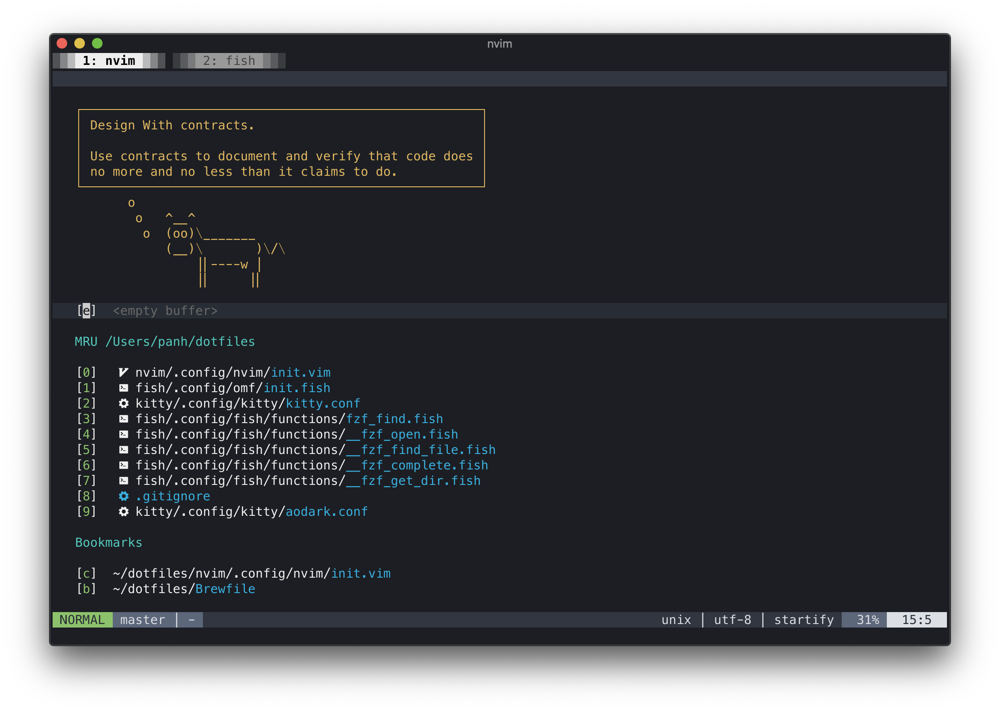
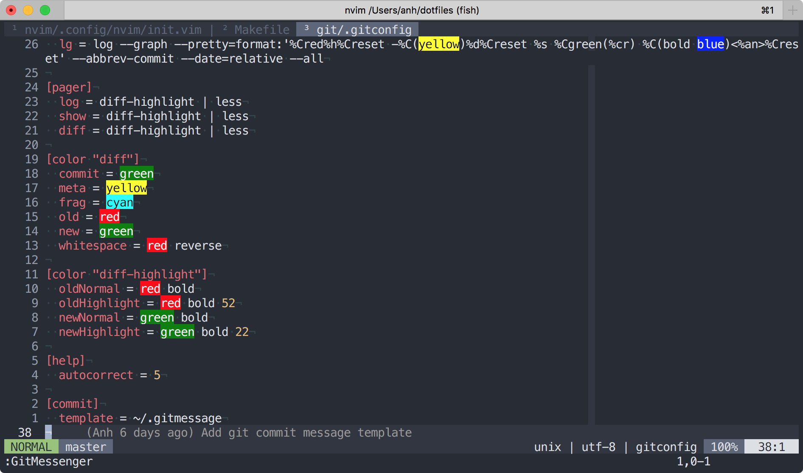
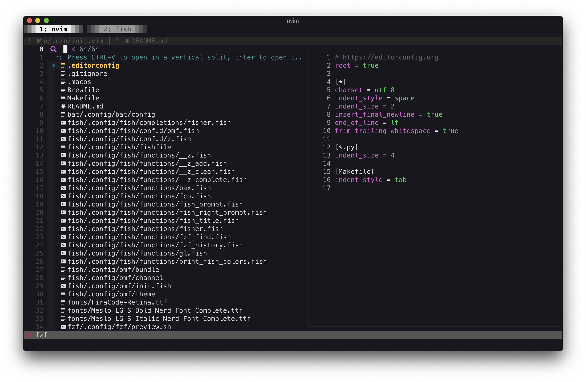
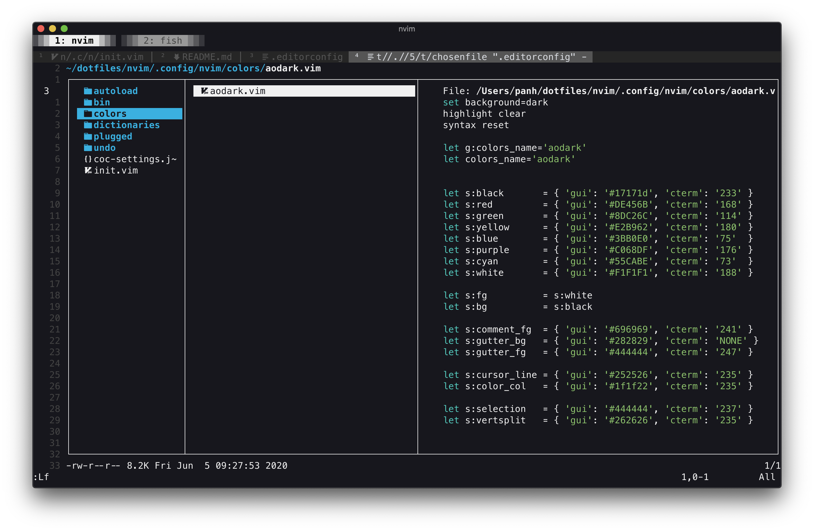
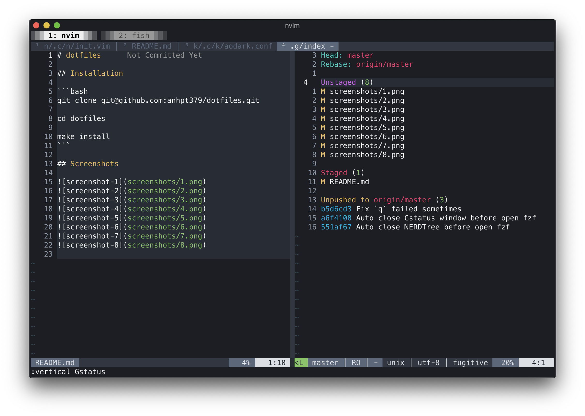
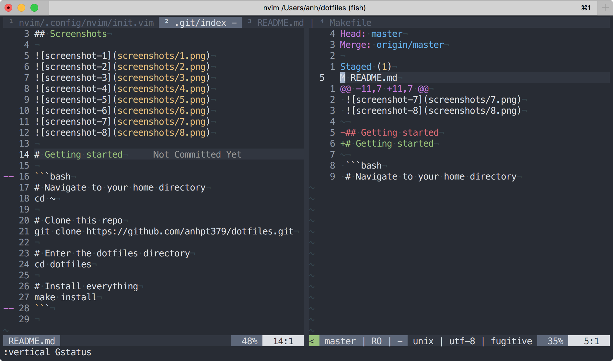
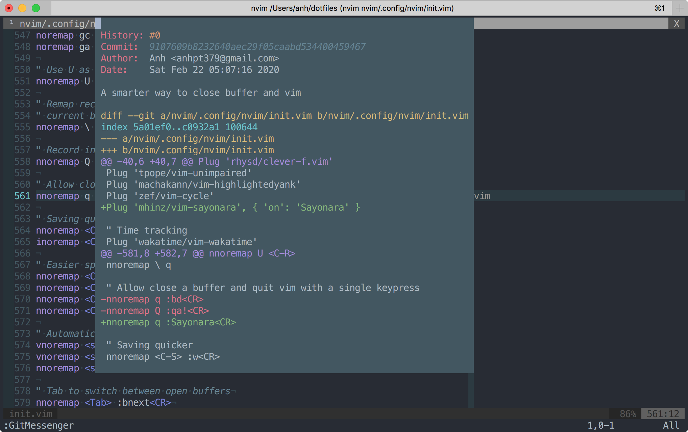
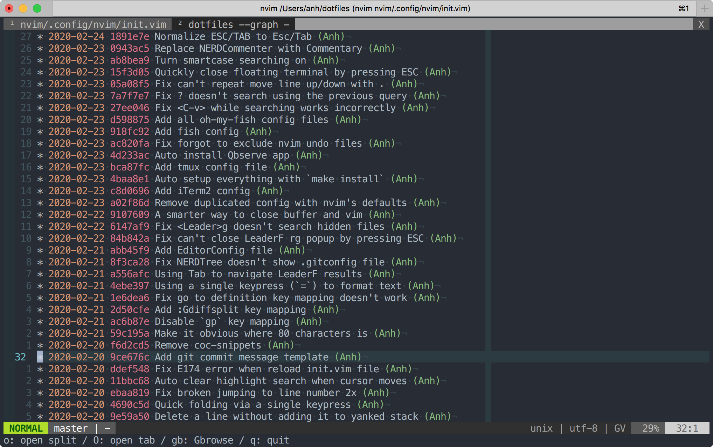

# My dotfiles

## Screenshots










## Getting started

```bash
# Navigate to your home directory
cd ~

# Clone this repo
git clone https://github.com/anhpt379/dotfiles.git

# Enter the dotfiles directory
cd dotfiles

# Install everything
make install
```

