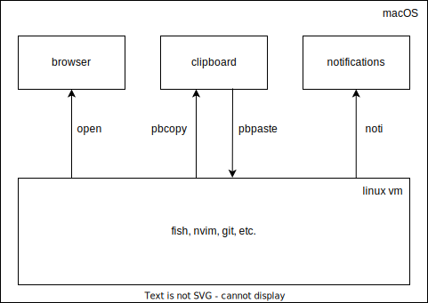
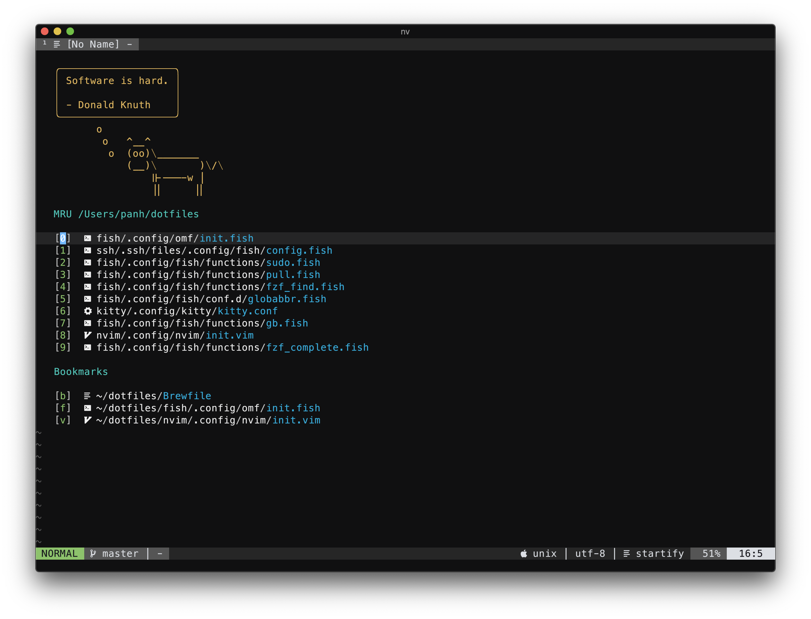
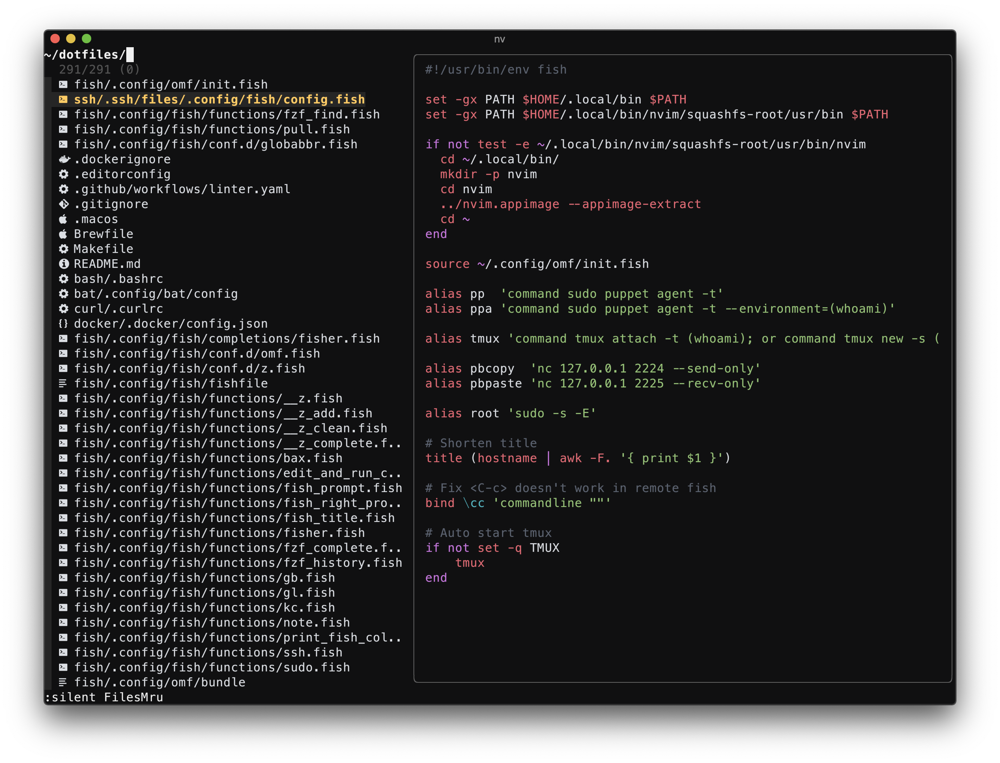
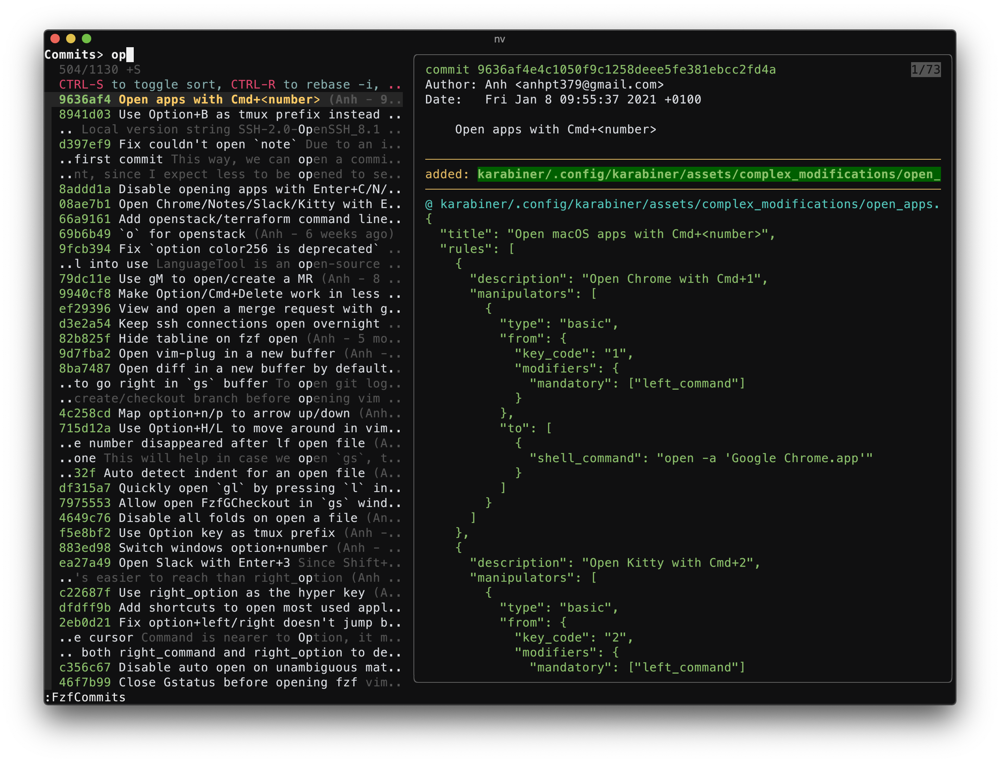
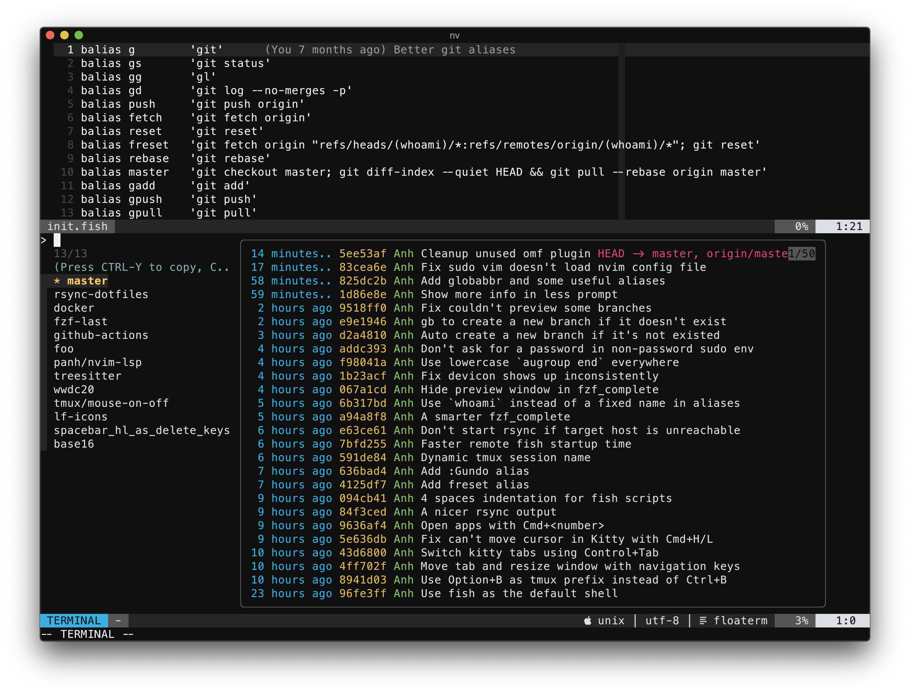
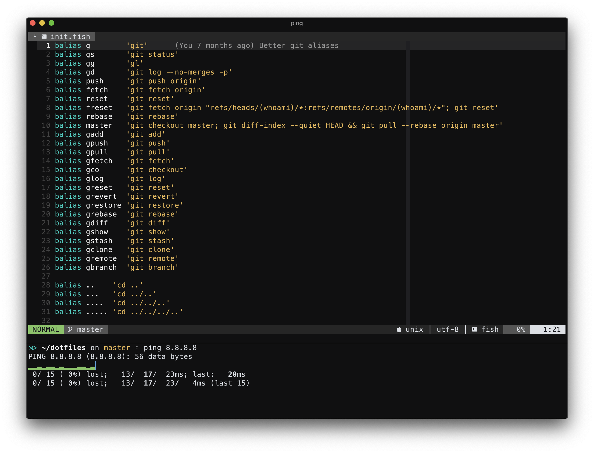
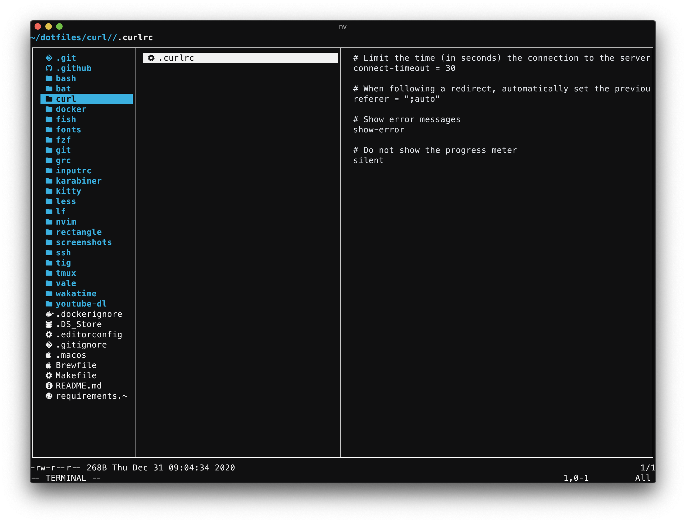
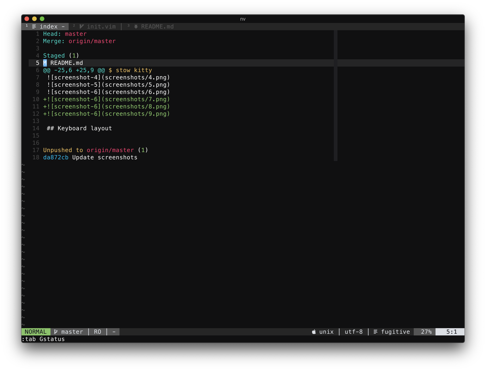
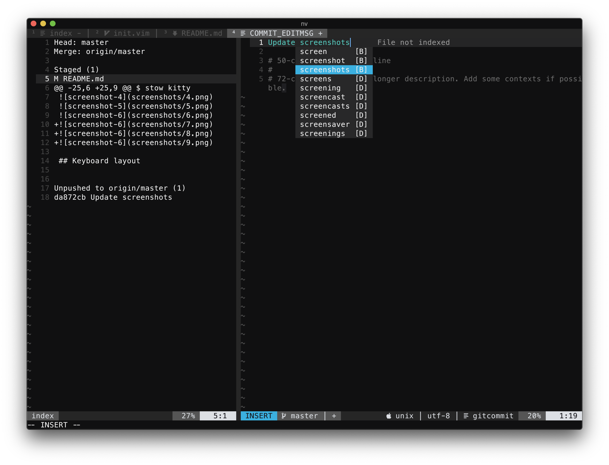

# Anh's dotfiles


## Installation

Clone this repo to `~/dotfiles` and run:

```bash
bash -c "$(curl -fsSL https://raw.githubusercontent.com/Homebrew/install/HEAD/install.sh)"
brew install stow vagrant fish kitty noti superbrothers/opener/opener

cd ~/dotfiles/macOS
stow kitty
stow fish
stow ssh

vagrant up
```

Then, open `Kitty` app, you will see yourself in a fish prompt within the
vagrant VM.

## Why using a VM

- it's isolated.
- easier to reproduce the setup.
- we're in the same OS as on servers.
- git operations are faster (`git status` on a large repo took 95ms in linux VM,
  250ms in macOS (Safe Mode) and 900ms in macOS with Forcepoint DLB Endpoint
  enabled).

### Why not using docker (with Docker Desktop on Mac)

- slow shared storage performance.
- no persistent storage within the container.

### Why not using native macOS

- security agents (in my case: Forcepoint DLP Endpoint) slow down file
  operations by a lot (~4-5 times).
- git operations [are slower](https://gregoryszorc.com/blog/2018/10/29/global-kernel-locks-in-apfs/) on APFS than on ext4 (~2-3 times).

## The setup



Key concepts:

- macOS is in charge of clipboard, notifications and GUI-based applications
  (Chrome, Slack, Kitty, etc.).
- the linux VM is in charge of text-based applications (fish, nvim, git, etc.).
- ssh port forwards (port 2224 → 2227) are being used to make `open`, `noti`,
  `pbcopy` and `pbpaste` commands work within the linux VM.

## What does it look like










## Key mappings

### vim

- `q` close buffer
- `Q` close all buffers
- `<Space>-s` startify
- `<Space>-f` fzf files (MRU)
- `<Space>-l` lf
  - `<Space>` select
  - `x` cut
  - `y` copy
  - `d` delete
  - `p` paste
  - `r` rename
  - `<C-f>` fzf jump
- `<Space>-g` ripgrep all files
- `<Space>-n` next buffer
- `<Space>-p` previous buffer
- `<Space>-<1-9>` jump to buffer #number
- `gs` git status
  - `a/Va` stage/unstage
  - `x/Vx` discard changes
  - `d` show diff
  - `p` git push
  - `C` commit
  - `ca` commit amend edit
  - `ce` commit amend no edit
- `gb` git branches
- `g[` git pull --rebase origin master
- `g]` git push origin HEAD --force-with-lease
- `gl` git log (repo)
- `gL` git log (current buffer)
- `vgl` git log (line)
- `gp` open github/gitlab pipelines in browser
- `go` open github/gitlab link in browser
- `gm` create/open MR
- `gw` write buffer to disk
- `M` switch to branch master

### tmux

- `<Option>-t` new tab
- `<Option>-w` close tab
- `<Option>-n` next tab
- `<Option>-p` previous tab
- `<Option>-]` move the current tab right
- `<Option>-[` move the current tab left
- `<Option>-r` reload config

### fish

- `<C-g>` accept suggestion and execute
- `<C-e>` edit the current command in vim
- `<C-r>` fzf history
- `<C-f>` fzf find

### Keyboard layout

Below is the adjusted keyboard layout that I'm using:

- `caps_lock` is `control` on held, `esc` on tapped
- `right_command` and `right_option` are `backspace` and `delete`

[][1]

[1]: http://www.keyboard-layout-editor.com/##@_backcolor=%23dbdbdb&name=Apple%20Wireless%20Keyboard&author=Alistair%20Calder&radii=6px%206px%2012px%2012px%20%2F%2F%2018px%2018px%2012px%2012px&css=%2F@import%20url(http%2F:%2F%2F%2F%2Ffonts.googleapis.com%2F%2Fcss%3Ffamily%2F=Varela+Round)%2F%3B%0A%0A%23keyboard-bg%20%7B%20%0A%20%20%20%20background-image%2F:%20linear-gradient(to%20bottom,%20rgba(0,0,0,0.5)%200%25,%20rgba(0,0,0,0)%204%25,%20rgba(255,255,255,0.3)%206%25,%20rgba(0,0,0,0)%2010%25),%20%0A%20%20%20%20%20%20%20%20%20%20%20%20%20%20%20%20%20%20%20%20%20%20linear-gradient(to%20right,%20rgba(0,0,0,0.1)%200%25,%20rgba(0,0,0,0)%20100%25)%20!important%2F%3B%20%0A%7D%0A%0A.keylabel%20%7B%0A%20%20%20%20font-family%2F:%20'volkswagen%2F_serialregular'%2F%3B%0A%7D%0A%0A%2F%2F*%20Strangely,%20%22Volkswagen%20Serial%22%20doesn't%20have%20a%20tilde%20character%20*%2F%2F%0A.varela%20%7B%20%0A%20%20%20%20font-family%2F:%20'Varela%20Round'%2F%3B%20%0A%20%20%20%20display%2F:%20inline-block%2F%3B%20%0A%20%20%20%20font-size%2F:%20inherit%2F%3B%20%0A%20%20%20%20text-rendering%2F:%20auto%2F%3B%20%0A%20%20%20%20-webkit-font-smoothing%2F:%20antialiased%2F%3B%20%0A%20%20%20%20-moz-osx-font-smoothing%2F:%20grayscale%2F%3B%0A%20%20%20%20transform%2F:%20translate(0,%200)%2F%3B%0A%7D%0A.varela-tilde%2F:after%20%7B%20content%2F:%20%22%5C07e%22%2F%3B%20%7D&pcb:false&plate:false%3B&@_y:1.5&t=%23666666&p=CHICKLET&a:5&f:5&fa@:3%3B%3B&=%3Ci%20class%2F=%22varela%20varela-tilde%22%3E%3C%2F%2Fi%3E%0A%60&=!%0A1&=%2F@%0A2&=%23%0A3&=$%0A4&=%25%0A5&=%E2%8C%83%0A6&=%2F&%0A7&=*%0A8&=(%0A9&=)%0A0&_fa@:3&=undefined%3B%3B&=%E2%80%93%0A-&=+%0A%2F=&_g:true&a:4&f:2&w:1.5%3B&=%0A%0A%0Adelete%3B&@_g:false&w:1.5%3B&=%0Atab&_a:7&f:5%3B&=Q&=W&=E&=R&=T&=Y&=U&=I&=O&=P&_a:5%3B&=%7B%0A%5B&=%7D%0A%5D&=%7C%0A%5C%3B&@_a:4&f:2&fa@:1%3B&w:1.75%3B&=esc%0Acontrol&_a:7&f:5%3B&=A&=S&=D&_n:true%3B&=F&=G&_a:5&fa@:0&:1&:0&:0&:0&:0&:0%3B%3B&=%0A%E2%86%90%0A%0A%0A%0A%0AH&=%0A%E2%86%93%0A%0A%0A%0A%0AJ&=%0A%E2%86%91%0A%0A%0A%0A%0AK&_sm=alps%3B&=%0A%E2%86%92%0A%0A%0A%0A%0AL&_f:5%3B&=%2F%3B%0A%2F:&_f:5%3B&=%22%0A'&_a:4&f:2&fa@:0&:1&:1&:0%3B&w:1.75%3B&=%0A%0Areturn%0Acontrol%3B&@_f:2&w:2.25%3B&=%0Ashift&_a:7&f:5%3B&=Z&=X&=C&=V&=B&=N&=M&_a:5&fa@:6%3B%3B&=%3C%0A,&=%3E%0A.&_f:5%3B&=%3F%0A%2F%2F&_a:4&f:2&w:2.25%3B&=%0A%0A%0Ashift%3B&@_g:true&h:1.111%3B&=%0Afn&_fa@:0&:0&:5%3B&h:1.111%3B&=%0A%0A%E2%8C%83%0Acontrol&_g:false&h:1.111%3B&=%0A%0A%E2%8C%A5%0Aoption&_w:1.25&h:1.111%3B&=%0A%0A%E2%8C%98%0Acommand&_a:7&w:5&h:1.111%3B&=&_a:4&fa@:5%3B&w:1.25&h:1.111%3B&=%E2%8C%AB%0Abackspace&_h:1.111%3B&=%E2%8C%A6%0Adelete&_x:1&g:true&a:7&f:5&h:0.611%3B&=%E2%86%91%3B&@_y:-0.5&x:11.5&g:false&h:0.6111%3B&=%E2%86%90&_g:true&h:0.6111%3B&=%E2%86%93&_g:false&h:0.6111%3B&=%E2%86%92

### Vim `HJKL` everywhere with [Karabiner](karabiner/.config/karabiner/karabiner.json)

When pressed together with `Command`, `Option` or `CapsLock`, `HJKL` will
become arrow keys (Left/Down/Up/Right):

- `Command` + `H/J/K/L` will perform character-level cursor movements.
  - Hold down an additional `Shift` key to select text.

- `Option` + `H/J/K/L` will perform word-level cursor movements.
  - Hold down an additional `Shift` key to select text.

- `Control` + `H/J/K/L` will perform page-level cursor movements.
  - Hold down an additional `Shift` key to select text.

- `CapsLock` + `N/P` to go down and up.

- `Command` + `N/P` to switch between tabs.

- `Command` + `<Right>/<Left>` to maximize/almost-maximize a window.
