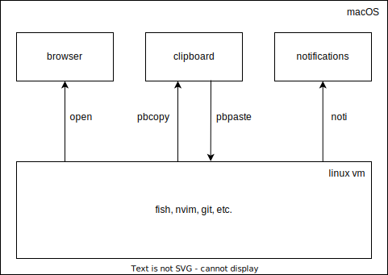

# Anh's dotfiles


## Installation

Clone this repo to `~/dotfiles` and follow the instructions in
`macOS/bootstrap.sh` and `local/bootstrap.sh`.

I'm using this lima [fedora42](macOS/lima/fedora42.yaml) image at the moment.

```bash
limactl start --name=fedora42 --yes macOS/lima/fedora42.yaml
limactl shell fedora42
sudo dnf install -y git
cd ~
git clone https://github.com/anhpt379/dotfiles.git
bash -x dotfiles/local/bootstrap.sh

# On the old VM:
mkdir /Users/$USER/data/fedora41
cd /Users/$USER/data/fedora41
mkdir -p .local/share/fish/ && cp ~/.local/share/fish/fish_history .local/share/fish/
mkdir -p .local/share/zoxide/ && cp ~/.local/share/zoxide/db.zo .local/share/zoxide/
mkdir -p .ssh/ && cp ~/.ssh/id_ed25519 .ssh/
mkdir -p .ssh/conf.d/ && cp ~/.ssh/conf.d/work.conf .ssh/conf.d/
mkdir -p .gnupg/ && cp -r ~/.gnupg/ .gnupg/
mkdir -p notes && cp -r ~/notes notes
mkdir -p data && cp -r ~/data data
tar cf code.tar ~/code

# Then, on macOS:
limactl copy -r ~/data/fedora41/ fedora42:~/

# Then, on the new VM:
cd
tar xf code.tar --strip-components=2
rm -f code.tar
```

Note: if switching to a new machine, it's better to compress `~/data` & transfer
it manually to the new machine using `python3 -m http.server`.

## The setup



**Key concepts:**

- macOS is in charge of handling clipboard, notifications and GUI-based
  applications (Chrome, Slack, Kitty, etc.).
- the linux VM is in charge of text-based applications (fish, nvim, git, etc.).
- ssh port forwards (port 2224 → 2227) are being used to make `open`, `noti`,
  `pbcopy` and `pbpaste` commands work within the VM.

**Why using a VM?**

- it's easier to reproduce the setup.
- git & docker are much (10x) faster.

**Why not using docker (with Docker Desktop for Mac)?**

- slow storage performance (`git status` on a docker volume was 8x slower than in
  a VM).

**Why not using native macOS?**

- git & docker operations are slow (`git status` on a relatively large repo takes
  `450ms`, vs `50ms` in a VM).

## Keyboard layout

- `tab` is `escape`
- `right command` and `right option` are `backspace` and `delete`.
- `:` and `;` are swapped.

[][1]

[1]:
http://www.keyboard-layout-editor.com/##@_backcolor=%23dbdbdb&name=Apple%20Wireless%20Keyboard&author=Alistair%20Calder&radii=6px%206px%2012px%2012px%20%2F%2F%2018px%2018px%2012px%2012px&css=%2F@import%20url(http%2F:%2F%2F%2F%2Ffonts.googleapis.com%2F%2Fcss%3Ffamily%2F=Varela+Round)%2F%3B%0A%0A%23keyboard-bg%20%7B%20%0A%20%20%20%20background-image%2F:%20linear-gradient(to%20bottom,%20rgba(0,0,0,0.5)%200%25,%20rgba(0,0,0,0)%204%25,%20rgba(255,255,255,0.3)%206%25,%20rgba(0,0,0,0)%2010%25),%20%0A%20%20%20%20%20%20%20%20%20%20%20%20%20%20%20%20%20%20%20%20%20%20linear-gradient(to%20right,%20rgba(0,0,0,0.1)%200%25,%20rgba(0,0,0,0)%20100%25)%20!important%2F%3B%20%0A%7D%0A%0A.keylabel%20%7B%0A%20%20%20%20font-family%2F:%20'volkswagen%2F_serialregular'%2F%3B%0A%7D%0A%0A%2F%2F*%20Strangely,%20%22Volkswagen%20Serial%22%20doesn't%20have%20a%20tilde%20character%20*%2F%2F%0A.varela%20%7B%20%0A%20%20%20%20font-family%2F:%20'Varela%20Round'%2F%3B%20%0A%20%20%20%20display%2F:%20inline-block%2F%3B%20%0A%20%20%20%20font-size%2F:%20inherit%2F%3B%20%0A%20%20%20%20text-rendering%2F:%20auto%2F%3B%20%0A%20%20%20%20-webkit-font-smoothing%2F:%20antialiased%2F%3B%20%0A%20%20%20%20-moz-osx-font-smoothing%2F:%20grayscale%2F%3B%0A%20%20%20%20transform%2F:%20translate(0,%200)%2F%3B%0A%7D%0A.varela-tilde%2F:after%20%7B%20content%2F:%20%22%5C07e%22%2F%3B%20%7D&pcb:false&plate:false%3B&@_y:1.5&t=%23666666&p=CHICKLET&a:5&f:5&fa@:3%3B%3B&=%3Ci%20class%2F=%22varela%20varela-tilde%22%3E%3C%2F%2Fi%3E%0A%60&=!%0A1&=%2F@%0A2&=%23%0A3&=$%0A4&=%25%0A5&=%E2%8C%83%0A6&=%2F&%0A7&=*%0A8&=(%0A9&=)%0A0&_fa@:3&=undefined%3B%3B&=%E2%80%93%0A-&=+%0A%2F=&_g:true&a:4&f:2&w:1.5%3B&=%0A%0A%0Adelete%3B&@_g:false&f:3&w:1.5%3B&=%0Aescape&_a:7&f:5%3B&=Q&=W&=E&=R&=T&=Y&=U&=I&=O&=P&_a:5%3B&=%7B%0A%5B&=%7D%0A%5D&=%7C%0A%5C%3B&@_a:4&f:3&w:1.75%3B&=%0Acontrol&_a:7&f:5%3B&=A&=S&=D&_n:true%3B&=F&=G&_a:5&fa@:0&:1&:0&:0&:0&:0&:0%3B%3B&=%0A%E2%86%90%0A%0A%0A%0A%0AH&_fa@:0&:1&:0&:0&:0&:0&:4%3B%3B&=%0A%E2%86%93%0A%0A%0A%0A%0AJ&=%0A%E2%86%91%0A%0A%0A%0A%0AK&_sm=alps%3B&=%0A%E2%86%92%0A%0A%0A%0A%0AL&_f:5%3B&=%2F%3B%0A%2F:&_f:5%3B&=%22%0A'&_a:4&f:3&w:1.75%3B&=%0A%0A%0Areturn%3B&@_w:2.25%3B&=%0Ashift&_a:7&f:5%3B&=Z&=X&=C&=V&=B&=N&=M&_a:5&fa@:6%3B%3B&=%3C%0A,&=%3E%0A.&_f:5%3B&=%3F%0A%2F%2F&_a:4&f:3&w:2.25%3B&=%0A%0A%0Ashift%3B&@_g:true&f:2&h:1.111%3B&=%0Afn&_fa@:0&:0&:5%3B&h:1.111%3B&=%0A%0A%E2%8C%83%0Acontrol&_g:false&h:1.111%3B&=%0A%0A%E2%8C%A5%0Aoption&_w:1.25&h:1.111%3B&=%0A%0A%E2%8C%98%0Acommand&_a:7&w:5&h:1.111%3B&=&_a:4&fa@:5&:0&:5&:0%3B&w:1.25&h:1.111%3B&=%E2%8C%AB%0Abackspace&_h:1.111%3B&=%E2%8C%A6%0Adelete&_x:1&a:7&f:5&h:0.611%3B&=%E2%86%91%3B&@_y:-0.5&x:11.5&h:0.6111%3B&=%E2%86%90&_h:0.6111%3B&=%E2%86%93&_h:0.6111%3B&=%E2%86%92

## Key mappings

### macOS

- `<Control>-<CapsLock>-m` Clipboard History (Maccy)
- `<Command>-<CapsLock>-n` Next Window (Karabiner)
- `<Command>-<CapsLock>-p` Previous Window (Karabiner)
- `<Command>-<CapsLock>-<Up>` Maximize (Rectangle)
- `<Command>-<CapsLock>-<Down>` Almost Maximize (Rectangle)
- `<Command>-<CapsLock>-<Left>` First Three Fourths (Rectangle)
- `<Command>-<CapsLock>-<Right>` Last Fourth (Rectangle)

### Browser

- `<Command>-t` new tab
- `<Command>-w` close tab
- `<Command>-n` next tab (MRU Tab Switcher - Normal switch forward)
- `<Command>-p` previous tab (MRU Tab Switcher - Normal switch backward)
- `<Command>-]` move current tab down
- `<Command>-[` move current tab up
- `<Command>-o` focus on the address bar
- `<Command>-u` undo close tab
- `<Command>-<Shift>-u` history
- `<Command>-y` copy url
- `<Command>-f` accept suggestion & go
- ``<Command>-` `` switch to previous tab (MRU Tab Switcher - Quick switch)
- `<Command>-<Shift>-t` search tabs
- `<Command>-<Shift>-n` next tab
- `<Command>-<Shift>-p` previous tab

### Tmux (local)

- `<Command>-t` new tab
- `<Command>-w` close tab
- `<Command>-n` next tab
- `<Command>-p` previous tab
- `<Command>-]` move current tab to the right
- `<Command>-[` move current tab to the left
- `<Command>-r` reload config
- `<Command>-s` open a split
- `<Command>-)` next split
- `<Command>-(` previous split
- `<Command>-'` resize split
- `<Command>-<Shift>-t` new window

### Tmux (remote)

- `<Option>-t` new tab
- `<Option>-w` close tab
- `<Option>-n` next tab
- `<Option>-p` previous tab
- `<Option>-]` move current tab to the right
- `<Option>-[` move current tab to the left
- `<Option>-r` reload config
- `<Option>-s` open a split
- `<Option>-)` next split
- `<Option>-)` previous split
- `<Option>-'` resize split

### Fish

- `<C-f>` accept suggestion and execute
- `<C-v>` edit the current command in vim
- `<C-r>` fzf history
- `<Tab>` fzf find

### Vim

- `q` close buffer
- `Q` close all buffers
- `<Space>-s` startify
- `<Space>-f` fzf files (MRU)
- `<Space>-l` lf
  - `<Tab>` select
  - `x` cut
  - `y` copy
  - `d` delete
  - `p` paste
  - `r` rename
- `<Space>-g` ripgrep all files
- `<C-n>` next buffer
- `<C-p>` previous buffer
- `gs` git status
  - `a/Va` stage/unstage
  - `x/Vx` discard changes
  - `d` show diff
  - `r` rebase
  - `m` open merge request link
  - `p` git push --force-with-lease
  - `P` git push --force
  - `C` commit
  - `ca` commit amend edit
  - `ce` commit amend no edit
  - `ga` git absorb
  - `rr` rebase continue
  - `ra` rebase abort
- `gb` git branches
- `g[` git pull --rebase origin master
- `g]` git push origin HEAD --force-with-lease
- `gl` git log
- `gL` git log current buffer
- `m` git log current line
- `gp` open github/gitlab pipelines in browser
- `go` open link to file on GitLab/GitHub
- `gO` copy link to file on GitLab/GitHub
- `gm` create/open MR
- `gw` write buffer to disk
- `M` switch to branch master

### Vim `HJKL` everywhere with [Karabiner](macOS/karabiner/.config/karabiner/karabiner.json)

When pressed together with `Command`, `Option` or `CapsLock`, `HJKL` will
become arrow keys (`Left`/`Down`/`Up`/`Right`):

- `Command` + `H/J/K/L` will perform character-level cursor movements.
  - Hold down an additional `Shift` key to select text.

- `Option` + `H/J/K/L` will perform word-level cursor movements.
  - Hold down an additional `Shift` key to select text.

- `Control` + `H/J/K/L` will perform page-level cursor movements.
  - Hold down an additional `Shift` key to select text.

- `CapsLock` + `N/P` to go down and up.
